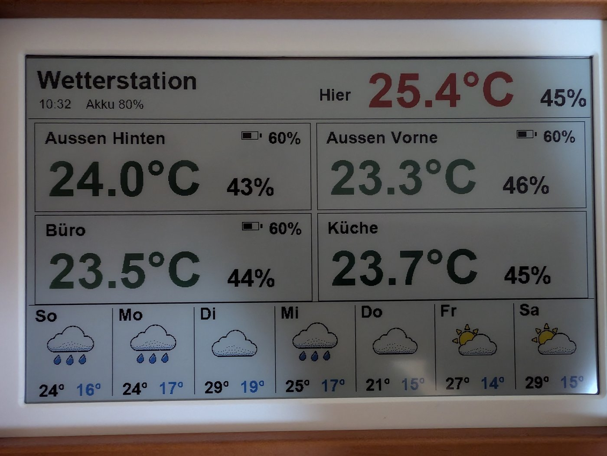
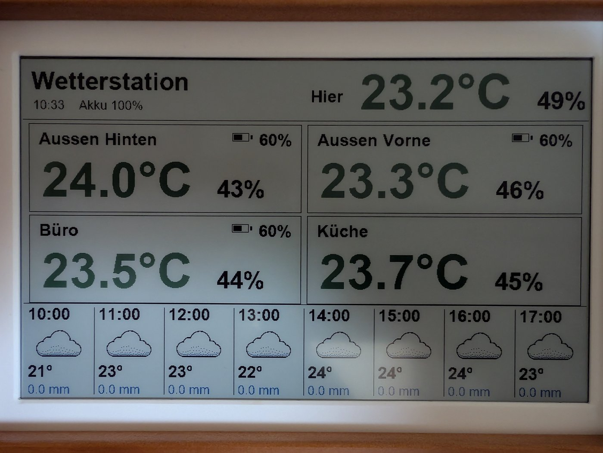

# ESP32-S3-PhotoPainter – Wetter-Monitor

Autarker E-Paper-Wetter-Monitor auf dem **Waveshare ESP32-S3-PhotoPainter**
(7,3″ Spectra-6 / E6 Vollfarb-E-Paper, 800×480). Zeigt **SwitchBot-Sensoren**
(über die SwitchBot-Cloud), die **lokalen Onboard-Sensoren** des PhotoPainters
und eine **7-Tage-Wettervorhersage** (Open-Meteo) – batteriebetrieben mit
Deep-Sleep.




## Features

- **4 SwitchBot-Sensoren** (Temperatur, Luftfeuchtigkeit, Batterie) über die
  SwitchBot Cloud API (HMAC-SHA256-signiert, via Hub 3 – keine BLE-Reichweiten-
  probleme).
- **Lokaler SHTC3** (Temp/Feuchte) + **AXP2101-Akkustand** im Header.
- **2×2-Farb-Layout** mit farbcodierten Temperaturen (blau/grün/rot) und
  Batterie-Warnung.
- **7-Tage-Wettervorhersage** (Open-Meteo, kein API-Key) als Balken mit eigenen
  Wetter-Icons, auf die 6 Panel-Farben quantisiert.
- **Deep-Sleep**: tags alle 10 min, nachts (00–05 Uhr) alle 30 min; Voll-Refresh
  nur bei tatsächlicher Wertänderung. Zeit via PCF85063-RTC + gelegentlichem NTP.
- Reine Logik (Signatur, JSON-Parsing, Intervall, Formatierung) mit
  **Host-Unit-Tests** (PlatformIO `native`, Unity) abgedeckt.

## Hardware

ESP32-S3-WROOM-1-N16R8 (16 MB Flash, 8 MB PSRAM). Onboard: SHTC3 (0x70),
PCF85063 RTC (0x51), AXP2101 PMIC (0x34). E-Paper über SPI
(MOSI 11, SCK 10, DC 8, CS 9, RST 12, BUSY 13).

> ⚠️ Das E-Paper hängt an einer **AXP2101-ALDO-Schiene** – diese muss beim Start
> aktiviert werden (siehe `local_sensors.cpp`), sonst bleibt das Panel stromlos
> und der Refresh läuft ins Leere.

## Setup

1. **PlatformIO** installieren (`pip install platformio`).
2. Konfigurationsdateien aus den Vorlagen anlegen (werden **nicht** versioniert):
   ```
   cp include/secrets.example.h     include/secrets.h
   cp include/user_config.example.h include/user_config.h
   ```
   - `secrets.h`: WLAN-SSID/Passwort + SwitchBot-Token/Secret
     (SwitchBot-App → Profil → App-Version 10× tippen → Developer Options).
   - `user_config.h`: deine 4 SwitchBot-`deviceId`s (MAC ohne Doppelpunkte) und
     die Koordinaten für die Wettervorhersage.
3. Bauen & flashen:
   ```
   pio run -e photopainter -t upload
   ```
   Host-Tests: `pio test -e native`.

## Konfiguration & Flashen

**`konfigurator.bat`** (Doppelklick, ohne Konsolenfenster) oder
`python tools/configurator.py` startet das Konfigurations-Tool:

- **Sensoren laden** holt alle Thermo-/Hygrometer aus der SwitchBot-Cloud
  (Token/Secret erforderlich). Auswahl, Name, Innen/Außen und Reihenfolge
  sind editierbar.
- **Anzeige-Modus:** Tages-Vorschau (4 Thermometer + 7-Tage-Leiste),
  Stunden-Vorschau (4 Thermometer + 8-Stunden-Leiste) oder 6 Thermometer (2×3).
- **Speichern** schreibt `tools/wetter_config.json` und generiert
  `include/user_config.h` + `include/secrets.h` (alle gitignored).
- **Upload** baut zuerst die Firmware, sucht dann den PhotoPainter frisch per
  USB-VID 303A (die COM-Nummer wechselt bei jedem Reset!) und flasht per
  PlatformIO. Nach dem Flashen das Board per PWR-Taste aus- und einschalten.

### Flashen-Hinweis (Akku-Falle)

Der PhotoPainter hat einen Akku – USB-Abstecken resettet den Chip **nicht**, und
die Deep-Sleep-Firmware kappt den USB-Port. Für einen zuverlässigen Upload in den
**Download-Modus**: Kabel ab → **PWR** aus → **BOOT** halten → Kabel ein (BOOT
halten) → BOOT loslassen. Danach normal booten (PWR aus/an ohne BOOT).

## Wetter-Icons & Fonts

Die Icons in `icons_src/` werden mit `tools/gen_icons.py` (Pillow) auf die 6
Panel-Farben quantisiert und als `src/weather_icons.h` eingebettet
(4 Bit/Pixel-Palettenindex, pixelweise gezeichnet).

Alle Schriften stammen aus `tools/gen_fonts.py`: Arial (Bold 36/18/12 pt,
Regular 9 pt) wird als Adafruit-GFX-Font nach `src/big_fonts.h` generiert –
Latin-1-indiziert inkl. **Gradzeichen und Umlauten**, sodass °C, Büro & Küche
echte Glyphen sind (Vorschau: `icons_src/_fonts_preview.png`).

## Projektstruktur

- `src/` – Firmware (Module: `switchbot_api`, `sb_sign`, `forecast`,
  `local_sensors`, `display_view`, `power_logic`, `view_model`, `main`).
- `test/` – native Unity-Tests.
- `tools/gen_icons.py` / `tools/gen_fonts.py` – Icon- und Font-Generator.
- `konfigurator.bat` / `tools/configurator.py` – Konfigurations- & Flash-Tool.
- `docs/superpowers/` – Design-Spec & Implementierungsplan.

## Lizenz

MIT
